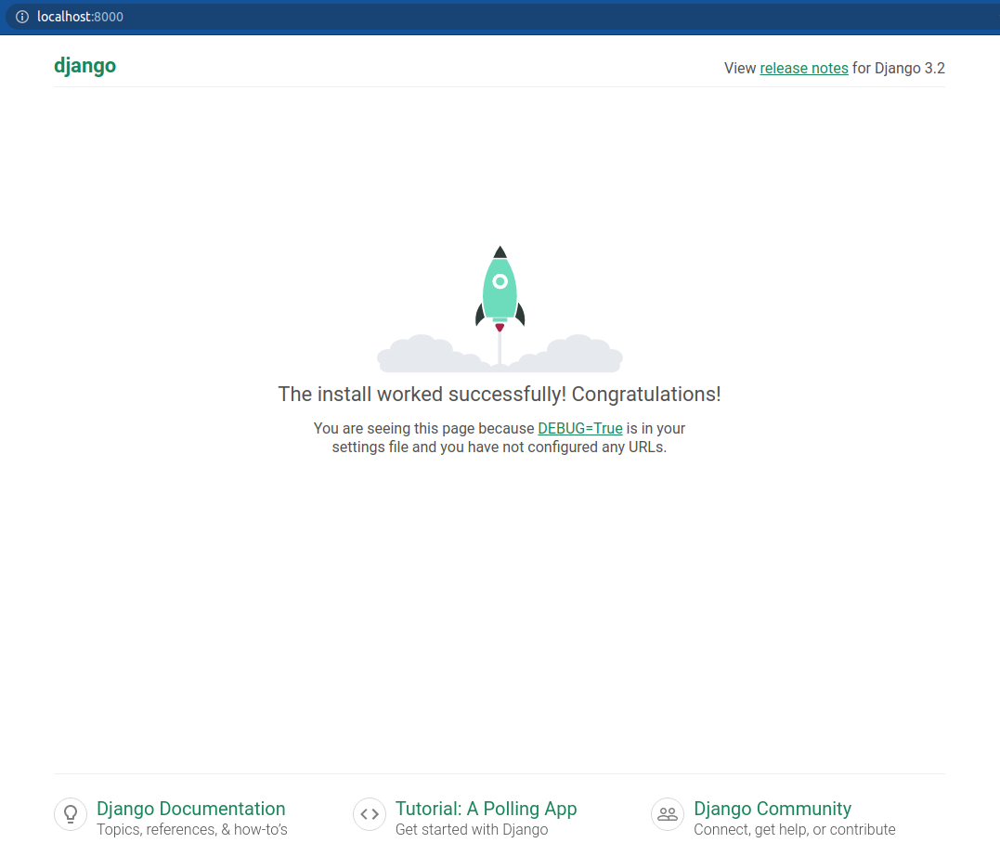
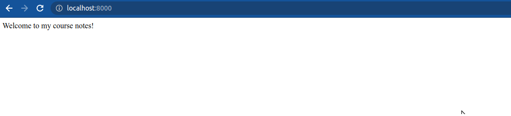
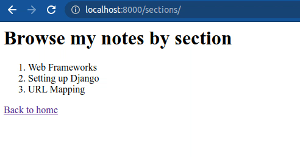
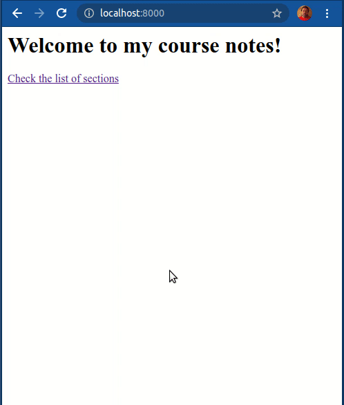
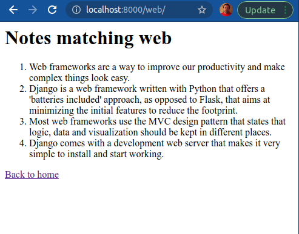
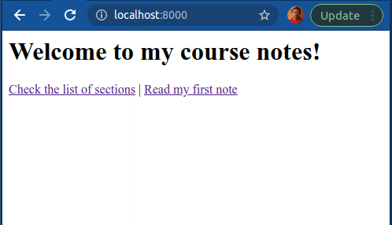
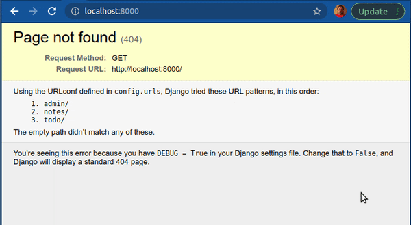
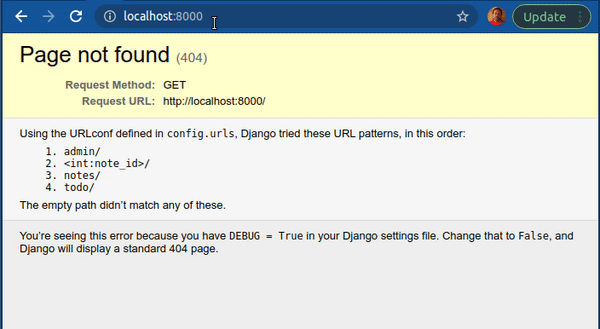

# Introduction to Django and URLconf

## Description

In this exercise, we will start a Django project and define some paths to connect some endpoints with some simple views.

Each tasks starts where the previous one ended.

## Tasks

### Task 1

Create a new Django project that produces this tree:

```shell
+ course
  + config
    - __init__.py
    - asgi.py
    - settings.py
    - urls.py
    - wsgi.py
  - manage.py
```

> Create a new virtual environment before you install Django (or almost any Python package).
>
> You may want to read about Django's [startproject command](https://docs.djangoproject.com/en/3.2/ref/django-admin/#startproject) before doing this task.

### Task 2

Create a new app named `notes` inside your Django project and run the development web server. Then open it in the browser (http://localhost:8000) and you should see the default Django home page.



Now write the code necessary to overwrite this page with your own view. When going to the root of your development server in the browser (http://localhost:8000) it should show the sentence `Welcome to my course notes!`.

> To overwrite the page you just need to define your own view and path with the root endpoint.

**Your website should look like this:**



### Task 3

Now, create a second path that defines an endpoint `sections/` that should show a title `Browse my notes by section`, the following list of sections and a link to go back to the notes home page.

```
- Web Frameworks
- Setting up Django
- URL Mapping
```

Use some basic HTML inside the string to show the title as a header (`h1`, `h2`, `h3`,...) and the sections as an ordered list (`ol` and `li`).

Additionally, change the home view so that it includes a link to the list (with the `a` HTML element). Use URL naming and the `reverse` function to write the links.

**Your website should look like this:**



### Task 4

Next, create a new path `sections/?????/` that accepts any text (replacing the `?????`) and passes it to a view showing a title `Notes about {text_passed}` and another list with a couple of notes for each section (you can use a conditional inside the view to return one text or another).

Add a link at the end that redirects the user to the list of sections.

Additionally, change the list of sections so that each section can be clicked and points to its own list of notes.

> Use any knowledge you have at hand to simplify the code. Example, you can use a function to return the HTML for a section list item and call it three times in your view.

**Your website should look similar to this:**




### Task 5

For this task, replace the `notes/models.py` file in your project with the one at [resources/task5/models.py](resources/task5/models.py).

This file has a list of dictionaries with some sample notes. Each note has a `text` key and a `section` key.

Before doing any other change you will have to adapt your current code to work with this new set of data.

Once you have done that, define a new endpoint `??????/` that accepts any non-numeric string and passes it to a view, who checks if this string is included in any of the notes and shows the notes that match.

> This end-point should not accept numbers.
>
> Once you are done, make sure all the endpoints still work as expected.

**If you go to http://localhost:8000/web/ you should see a page similar to this one:**



### Task 6

Now define another endpoint `??????/` that accepts only numbers and passes them to another view, who shows the note in the position equal to the number passed.

This page should show a main title with the number of the note, then a secondary title with the section it belongs to and, finally, a paragraph with the note text.

Additionally, add a link in your home page pointing at the first note (number 1).

> This end-point should not accept text.
>
> Do not write the links, use the `reverse` function, instead.
>
> If you can, try to add a couple of navigational links to jump from one note to the next and previous.
>
> Once you are done, make sure all the endpoints still work as expected.

**If you go to http://localhost:8000/ you should see a page similar to this one:**



**If you go to http://localhost:8000/web/ you should still see the behavior described in the previous task.**

### Task 7

Now, start a new Django app named `todo`. Replace the `todo/models.py` file in your project with the one at [resources/task7/models.py](resources/task7/models.py).

This file has a sample list of To Dos.

We want to have another endpoint that shows the details of a todo item (using a numeric id as we just did with the notes).

But we have one main *problem*, now. We can see a detail view of each note by going to http://localhost:8000/{id}/ but our website has two data sets and the URL doesn't tell which data set we are accessing.

We could leave the notes as they are and define the To Do detail view as http://localhost:8000/todo/{id}/, but we prefer to refactor our notes endpoints to use the slug `notes` as well.

> Everything that has to do with `notes` will have an endpoint always starting with `notes/`.
>
> Everything that has to do with `todo` will have an endpoint always starting with `todo/`.

So, first, start by removing all the notes path definitions from the `config/urls.py` file and group them together in the app `notes/urls.py`.

Once done, review all the functionality from previous steps and make sure they work and all of them use endpoints starting with `notes/`.

Then, create the todo detail view defining the path in the `todo/urls.py` file. The endpoint should be `todo/?????/`.

**Your website should now look similar to this:**



### Task 8

We now realize that some people had the notes bookmarked as http://localhost:8000/{id}/.

Your task is to create a new endpoint matching the previous pattern that redirects the user to the new URL at `notes/{id}/`.

> You will have to point the path to a new view the does the redirection.

Additionally, refactor your code to use namespacing for each of the app views.

**Once you are done, your website should look similar to this:**


